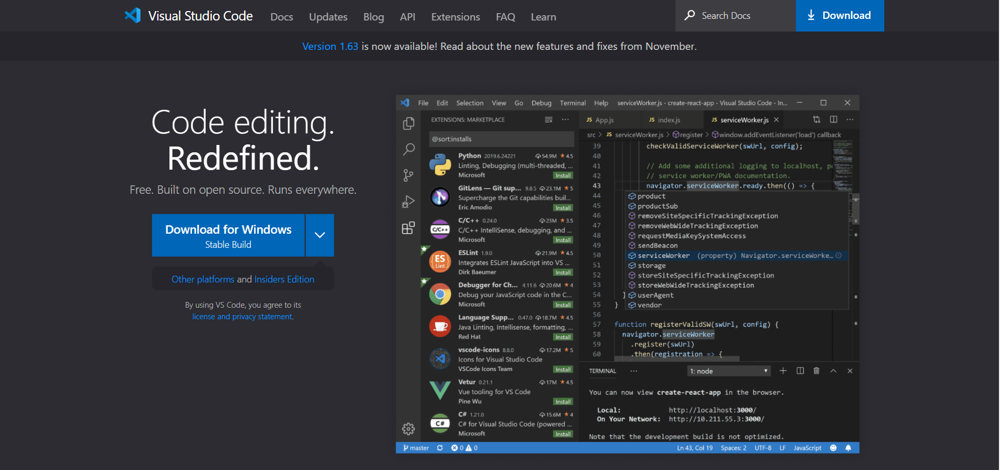
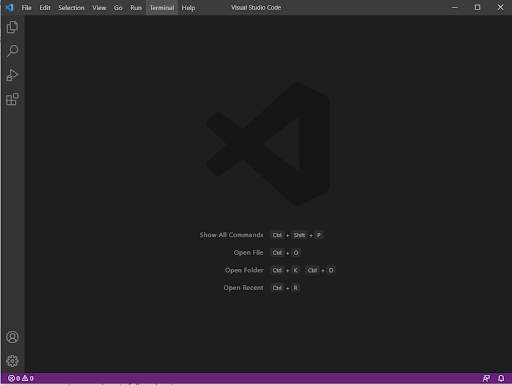
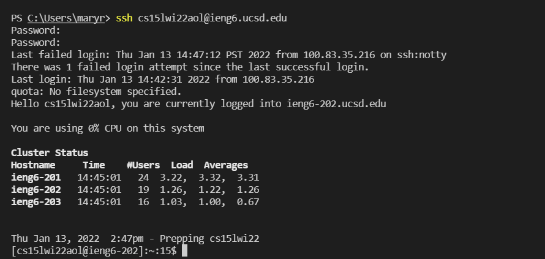
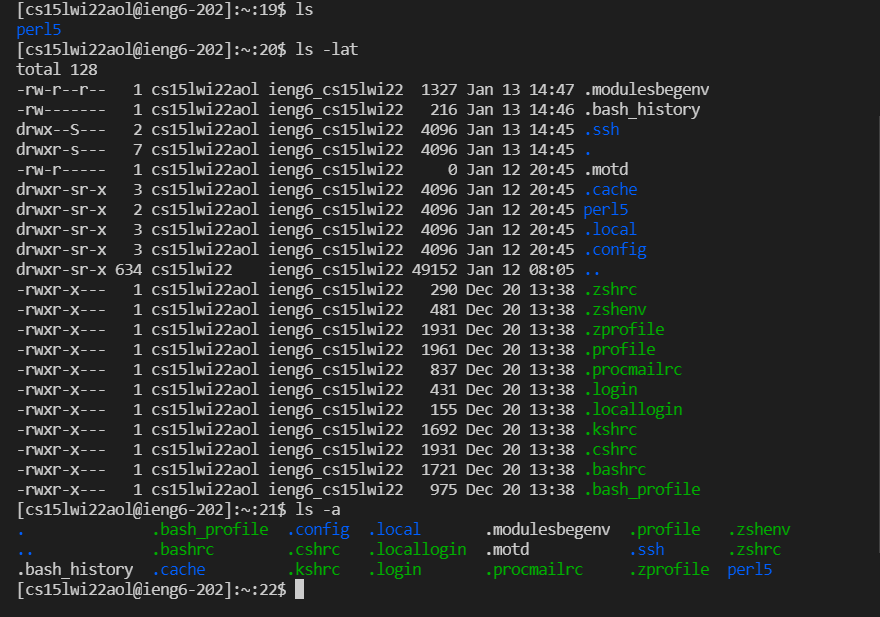
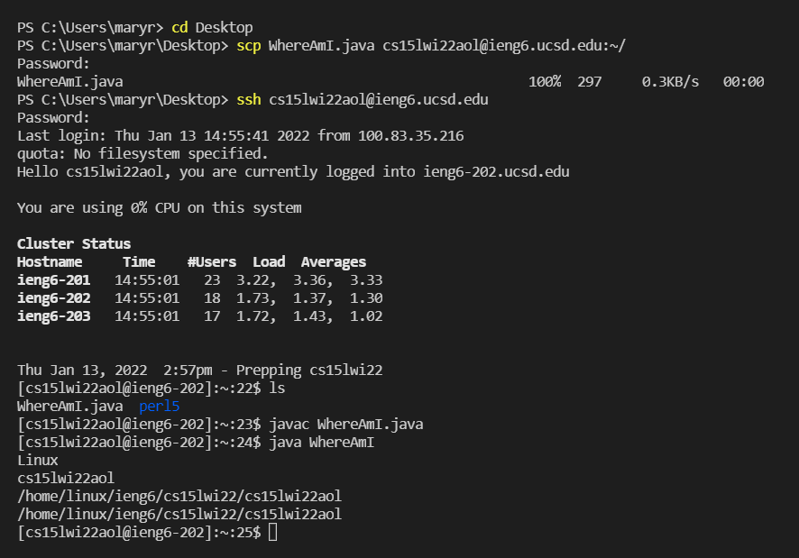
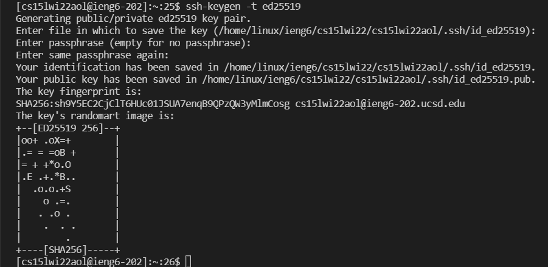
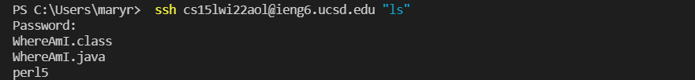
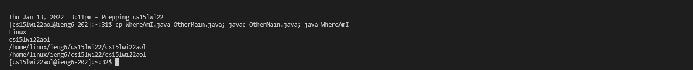

# Lab Report 1: How to log into a Course-Specific Account on ieng6
*By Mary Ramada*

## Step 1: Downloading VS Code

The first thing you're going to want to do is go to [VSCode](code.visualstudio.com).
Here we are going to download Visual Studio Code for whichever OS necessary. I have a Windows, so it shows a "Download for Windows" button on my screen, but by clicking that blue arrow it will show you other OS download options. 
```
```
## Step 2: Set Up 


Once you open VS Code, your screen should look something like this. From this point, you want to open the terminal from the bar in the top left corner. This will allow us to send commands to remotely connect. 
```
```
## Step 3: Connecting to Server
In the terminal, you are going to write the following command except with your 3-digit ID instead of the "aol": 
> ssh cs15lwi22aol@ieng6.ucsd.edu

Once that runs, you should see something similar to this. Because this isn't my first time connecting to the server, the terminal doesn't prompt me with a statement about my security. (If it does, you should accept)


After entering your password, you should be successfully connected and your terminal will look a bit like this. 
```
```
## Step 4: Testing out Commands
Below are some commands I reccomend trying. I have provided my own explanation for each command in case you're curious :). 

>  * cd : This changes your directory to whatever you type in afterwards.
> * ls : lists files and directories 
> * ls -lat : lists files sorted by date
> * ls -a : lists files more compactly
> * scp : Secure copy from local to ssh


Here is an example of me running some of the commands listed above. 
```
```
## Step 5: Moving Files Using scp
So now that we know how to connect to remote computers, it would be helpful to be able to move files between them. In this step I will be walking you through how to transfer files from your personal computer to the remote computer you previously connected to. 

In the terminal, you are going to write the following command except with your 3-digit ID instead of the "aol", and whichever local file you want to move. (I used a file on my computer called WhereAmI): 
> scp WhereAmI.java cs15lwi22aol@ieng6.ucsd.edu:~/


As you can see towards the top of this picture, it will then prompt you again for your password. Once you enter that in, it should show you your file right underneath. To check that it is there, you can login to the remote computer once again (with the ssh command remember!), and then type the **ls** command in the terminal as you are running it on the remote computer. If all goes will, it should then list your file!
```
```
## Step 6: Setting up an SSH Key
You might have noticed that connecting to the remote computer and running its commands prompt you for your login. To save time, we can setup an SSH Key to bypass this task. 

`An SSH key is a set of files (one on the remote computer and one of your own that are linked to one another and can check for the other instead of requiring the user to type in a password.`

To create this SSH key you are going to want to run this command: 
> ssh-keygen

Since I am on Windows, I need to run this instead: 
> ssh-keygen -t ed25519 

Once you have done that it should look something like this:


(Personally I left the passphrase empty to save time)

After this step, the set of files should now be in the .ssh of your computer. Now I am going to move the public key (id_rsa.pub) to the remote computer by running:
> * mkdir .ssh --> to get the path of the file
> * scp /Users/maryr/.ssh/id_rsa.pub cs15lwiaol@ieng6.ucsd.edu:~/.ssh/authorized_keys --> replace the username and path

```
```

## Step 7: Tips to Speed up Remote Running
1. One thing you can do is to add quotes to a command after your ssh command to run it on the remote computer. Just be careful because this exits the remote computer once the command ends. An example of such is shown below: 


2. If you want to run more than one command, instead of typing each one per line, you can combine the commands with semicolons. An example of such is shown below: 



