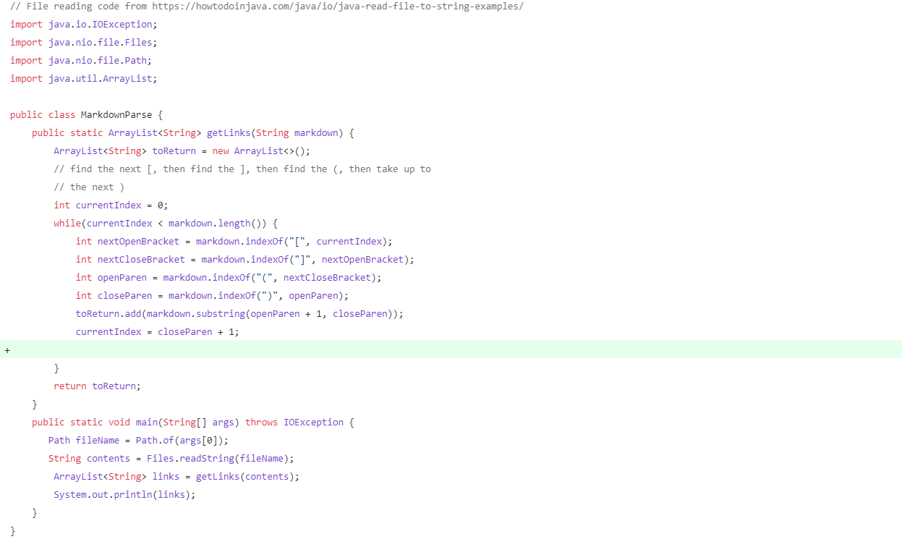
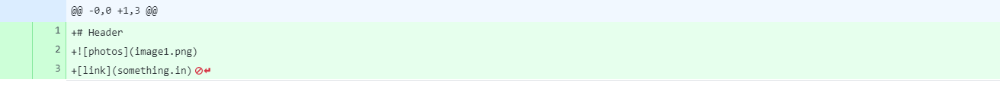
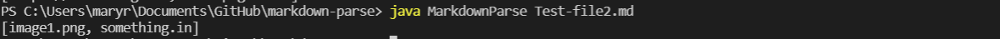
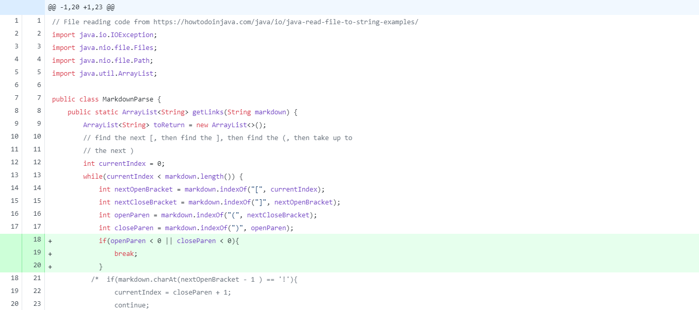
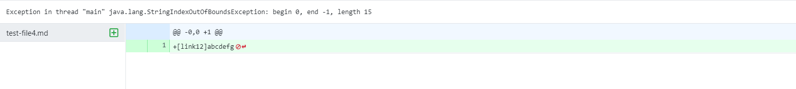
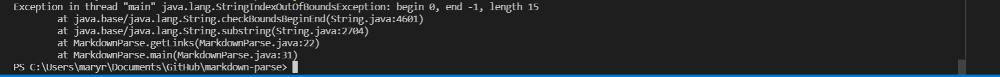
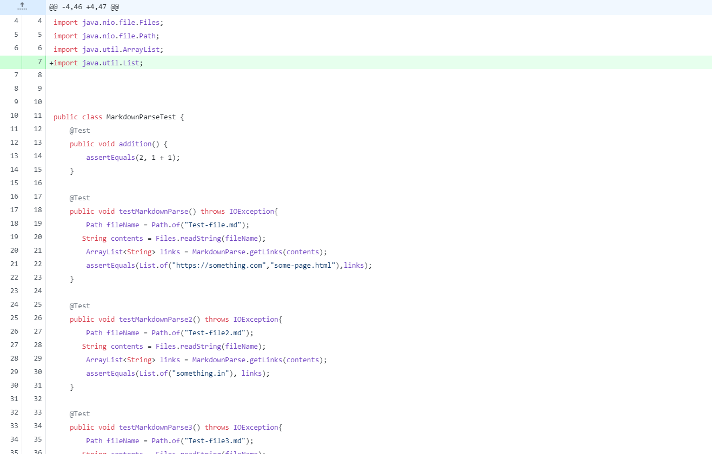
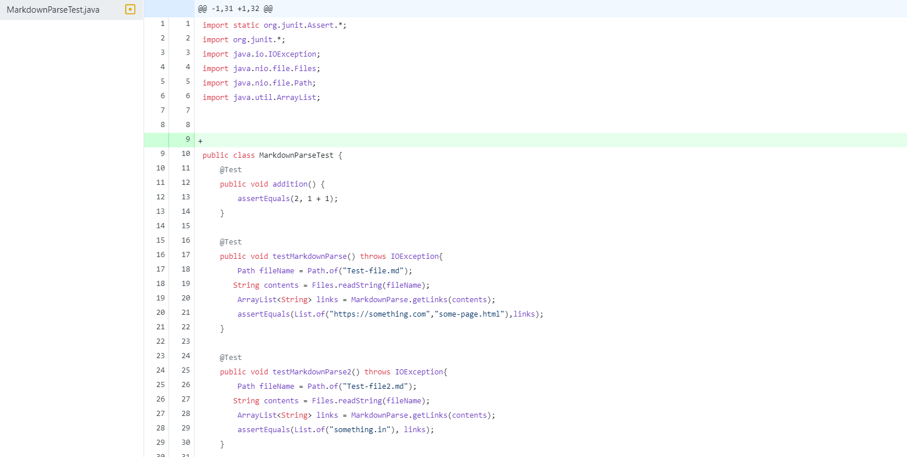
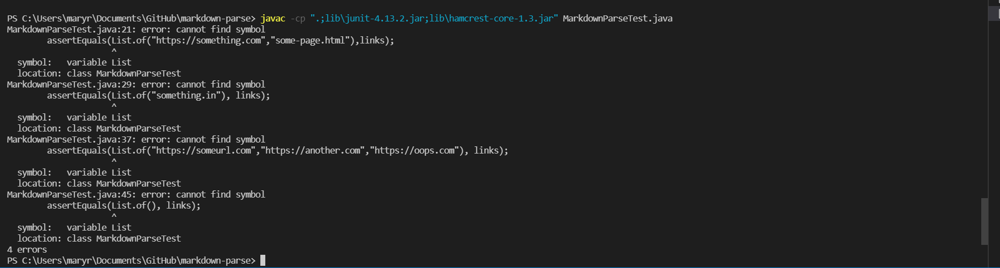

# Lab Report 2: Bug, Symptom, and Failure-Inducing Input
*By Mary Ramada*

## Code Change 1: Accepting Images Error  
 



[Link to test file 2 here](https://github.com/mramada22/markdown-parse/blob/main/test-file2.md)

In this code change, test-file2 includes one photo and one link. The photo link causes a bug in the code, as the program recognizes the image as something in brackets and parenthesis, and assumes it is a link.The code returns an array list of both the image and the link, therefore, test-file-2 is the failure inducing input as it causes this bug to occur. This output can be seen in the last photo (the symptom), which displays the array with the picture and the link. 
```
```
## Code Change 2: Improper Link Format




[Link to test file 4 here](https://github.com/mramada22/markdown-parse/blob/main/test-file4.md)

In this code change, test-file4 contains a link with improper format as there are no parenthesis surrounding the "link", causing this test file to be the failure-inducing input because this causes an error in the code. The symptom is an index out of bounds exception, as seen through the output of the code. The bug is that the program cannot find the indices of the parenthesis, causing the indexOf calls for the open parenthesis to return 0. This causes the substring call to cause the symptom to appear when the code compiles. 
```
```
## Code Change 3: 




[Link to test file here](https://github.com/mramada22/markdown-parse/blob/main/MarkdownParseTest.java)

In this code change, the failure-inducing input is as seen in the photo with the Assert Equals containing the List.of method. The symptom is the program returns an error: cannot find symbol as seen in the output. The bug is the fact that the program is unable to recognize what List.of is. Because I did not originally import the java List class, my program could not access the List.of method within that class, thus preventing the lines containing the list.of from working properly. 
