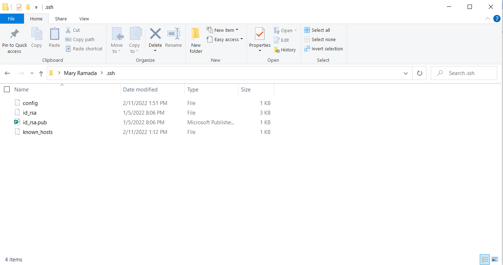
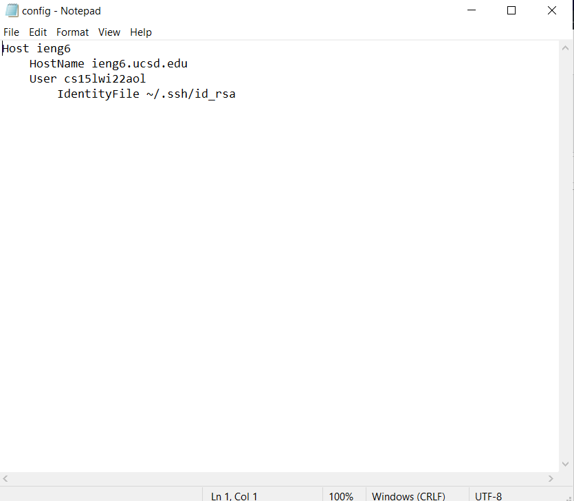

# Lab Report 3: Streamline ssh Configuration (on a Windows)
*By Mary Ramada*
```
```
## Step 1: Locate .ssh folder & create config
 

The first step is to find my .ssh folder through my file explorer. From here I created a file labeled **config**. Make sure this file isn't of type txt (my first mistake), and if it automatically creates it as one you can rename it to delete the extension. 
```
```
## Step 2: Edit config file 
 

Next I copied the following Host/HostName/User lines above my given account. Because I am on a Windows, I double checked the .ssh folder to locate the id_rsa file and made sure the name of that file matches what is is in my config file. 
```
```
## Step 3: Test Login

 
 

From here, I was able to login to my ssh account and scp without having to type my whole account address, and only wrote the commands as such: 
> ssh ieng6

> scp ieng6