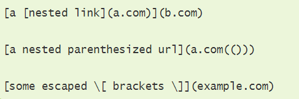
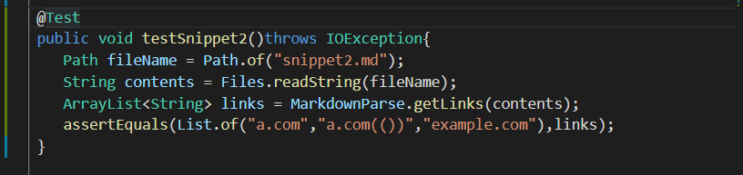

# Lab Report 4: Testing Markdown Parse
*By Mary Ramada*
```
```
## Snippet 1: 


- Shown above is code snippet 1, and its supposed output through VSCode Preview.  


- Based on the preview, I created this test to expect the following links. 


*Running snippet 1 test on my markdown-parse*


*Running snippet 1 test on the implementation I reviewed*

**Do you think there is a small (<10 lines) code change that will make your program work for snippet 1 and all related cases that use inline code with backticks? If yes, describe the code change. If not, describe why it would be a more involved change.**

> I think there could be a small change that would make my program work for snippet 1. Since the backtick only really affects the part of the line with brackets [], I could make
an if statement that checks for double back ticks before searching for the open parenthesis.
If found, I would then make sure that the indices are in between the bracket indices and continue. If not, then I would alter the indices of searching for paren/brackets to the following line. 
```
```
## Snippet 2: 



- Shown above is code snippet 2, and its supposed output through VSCode Preview.  



- Based on the preview, I created this test to expect the following links. 


*Running snippet 2 test on my markdown-parse*


*Running snippet 2 test on the implementation I reviewed*

**Do you think there is a small (<10 lines) code change that will make your program work for snippet 2 and all related cases that nest parentheses, brackets, and escaped brackets? If yes, describe the code change. If not, describe why it would be a more involved change.**

> I think that in order to fix all related cases with nest parentheses/brackets/escaped brackets, it would require a more involved code change. I need some sort of method to check for matched parenthesis/brackets/escaped brackets within a line, making sure that they are paired up with one another (even number count). Then, I need to call this method within the current while loop that computes the indices of the open/close parentheses, and break out of the while loop or continue if necessary. 
```
```
## Snippet 3: 


- Shown above is code snippet 3, and its supposed output through VSCode Preview.  


- Based on the preview, I created this test to expect the following links. 


*Running snippet 3 test on my markdown-parse*


*Running snippet 3 test on the implementation I reviewed*