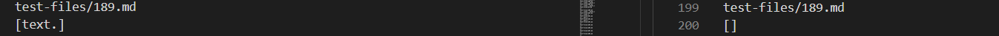

# Lab Report 5: Analyzing Different Ouputs from Different implementations of MarkdownParse.java
*By Mary Ramada*
```
```
## Question 1: How you found the tests with different results (Did you use diff on the results of running a bash for loop? Did you search through manually? Did you use some other programmatic idea?)

I realized after running my lab group's Markdown Parse file, that there was an extra added print statement that would cause the code to print its result on the same line that it prints out the text file (the printing of the text file was done in the main method of the MarkdownParse file). Because of this, adding an echo to the script file would cause the lines to be off, preventing diff from working properly. Therefore, I just manually compared the differences in the test file output. 
```
```
## Code Difference 1: 


The images above show test-files/14.md, and its outputs on my lab group's MarkdownParse file (left), and the Professor's MarkdownParse file (right). 
As you can see, 14.md should not return anything, as the backslash within markdown is meant to escape the markdown operation, therefore aadding a backslash before the link in line 3 should not count (/foo).
Because BOTH files did not produce an empty output, both are incorrect. 


* Describing the bug: The code above is taken from the Professor's implementation of MarkdownParse. As you can see, there seems to be no check for a backslash before the openBracket index (and only checks for extra spaces or new lines), therefore it is still counting it as a link, as it finds valid open and close parenthesis. 
```
```
## Code Difference 2:


The images above show test-files/189.md, and its outputs on my lab group's MarkdownParse file (left), and the Professor's MarkdownParse file (right). 
As you can see, 139.md does not contain any links (only emphasized text), and should therefore have an empty output. In the professor's implementation, this is outputted correctly, whereas my lab group's implementation returned [text.].


* Describing the bug: The code above is taken from my lab group's implementation of Markdown Parse. As you can see, it is slightly different compared to the Professor's, as the program utilizes "stop characters" find the indices of where the beginning/end of a link occurs. It also searches for these stop characters from the index of the period and outwards. Because the file contains a period, the program does not ender the break, and continues to find any one of the stop characters. Since there is a space right before the "text.", the program recognizes this as a stop character and maintains the index for the beginning of the link. At the end, when the program exits the loop, the substring of this starting index and ending index is the output, therefore producing [text.]. 